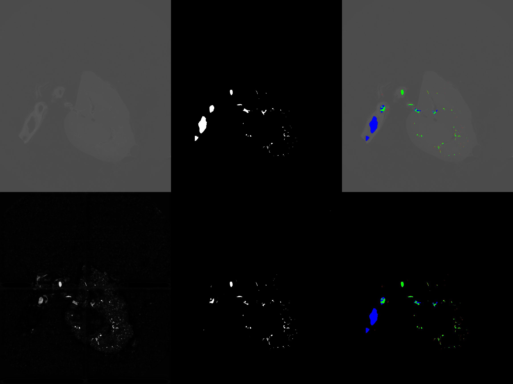
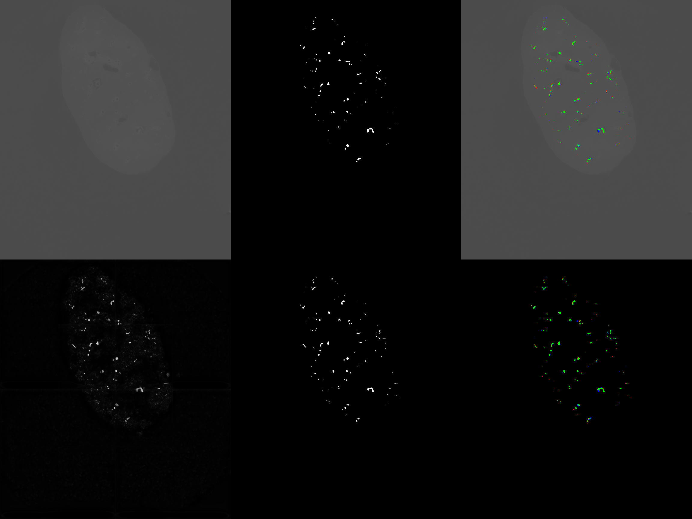
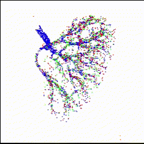

# Kaggle competition "SenNet + HOA - Hacking the Human Vasculature in 3D" solution

## The problem

### Dataset

TODO: Describe the kidney IDs and shortnames

## My solutions

### Backbones and libraries

### 2D

### 2.5D

## Results

### Ranking

Private score descending order

|     Model             |  Val dataset   | Val avg 2D dice score  | Val surface dice score | Public LB  | Private LB |   Notes    |
|-----------------------|----------------|------------------------|------------------------|------------|------------|------------|
| (Late) Submission V50 |      3s        |       0.269            |        0.398           |   0.552    |   0.500    | Late submission |
| Submission V48        |      3s        |       0.534            |        0.575           |   0.574    |   0.493    | Best submission before the deadline, not selected |
| Submission V47        |      3s        |       0.589            |        0.593           |   0.585    |   0.491    | Best selection for the challenge, rank 158/1149 |
| (Late) Submission V55 |      3s        |       0.433            |        0.494           |   0.566    |   0.480    | Late submission |
| Submission V46        |      3s        |       0.593            |        0.592           |   0.579    |   0.462    | Selected for the challenge  |
| (Late) Submission V53 |      3s        |       0.046 ?!         |        0.061 ?!        |   0.561    |   0.400    | Late submission  |
| Submission V41        |      3s        |       0.550            |        0.401           |   0.493    |   0.374    | tta 5+full_max  |
| (Late) Submission V54 |      3s        |       0.425            |        0.420           |   0.421    |   0.365    | Late submission  |
| Submission V40        |      3s        |       0.579            |        0.326           |   0.291    |   0.251    | No tta  |

Note: I have run the same trainings offline in my machines, but the results are identical although practically similar 
on the test dataset. This behavior was not fixed even when forcing determinism (determinism is working).
However the best models offline were the best online as well.

TODO: Talk about bigger training dataset doesn't always improve the performances

TODO: Comment V55 Vs V50

TODO: Why V53 so low?

TODO: Comment volatily

TODO: Comment impact of tta on surface dice and tta no full.

TODO: Run missing submissions locally

### Models' details

|                       |    Train dataset   |   Train resolution | Train augmentation |    Loss    | Test resolution | Test augmentation | Threshold |
|-----------------------|--------------------|--------------------|--------------------|------------|-----------------|-------------------|-----------|
| (Late) Submission V50 |   1d+1v+2          |      512x512       |       my_aug_v2b   | Dice loss  |   1024x1024     |      tta 5+max     |     0.1   |
| Submission V48        |    1d              |      512x512       |       my_aug_v2b   | Dice loss  |   1024x1024     |      tta 5+max     |     0.1   |
| Submission V47        |  1d                |      512x512       |       my_aug_v2b   | Focal loss |   768x864       |      tta 5+max     |     0.4   |
| (Late) Submission V55 |   1d+1v+2          |      512x512       |       my_aug_v2b   | Dice loss  |   768x864       |      tta 5+max     |     0.1   |
| Submission V46        |  1d                |      512x512       |       my_aug_v2b   | Dice loss  |   768x864       |      tta 5+max     |     0.1   |
| (Late) Submission V53 |   1d               |      512x512       |       my_aug_v2b   | Focal loss |   1024x1024     |      tta 5+max     |     0.4   |
| Submission V41        |   1d               |      512x512       |       2.5d_aug     | Focal loss |   1024x1024     |      tta 5+full_max|     0.4   |
| (Late) Submission V54 |   1d+1v+2          |      512x512       |       my_aug_v2b   | Focal loss |   1024x1024     |      tta 5+max     |     0.4   |
| Submission V40        |   1d               |      512x512       |       2.5d_aug     | Dice loss  |   1024x1024     |      No            |     0.1   |

TODO: Comparison between augmentations. my_aug_v2b was the best in exact comparisons

TODO: Explain major improvements like upscaling functions

### 2D comparison

Image tiles descriptions:
- Top left: original image
- Top middle: ground truth
- Top right: comparison prediction Vs ground truth overlay on image
- Bottom left: raw prediction
- Bottom middle: binarized prediction with threshold
- Bottom right: comparison

Colors:
- Green: true positives
- Blue: false negatives
- Red: false positives

#### kidney_3 sparse ground truth Vs model V47

Slice 170/1035 - Dice score 0.42 (a lot of false negatives)

Slice 785/1035 - Dice score 0.80

Comment: the model works well with small vessels, but it completely ignores
the big one on the left. This is more evident with the 3D visualization below.

### 3D comparison

The 3D points clouds are rescaled to 10% for faster processing

Colors:
- Green: true positives
- Blue: false negatives
- Red: false positives

#### kidney_3 sparse ground truth Vs model V47

Here we can see where the false negatives are concentrated

TODO: Add an example with dice loss to highlight the different behavior on raw values