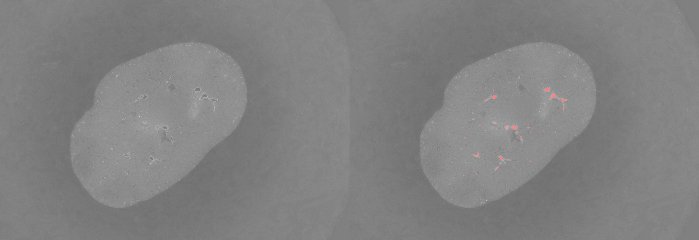
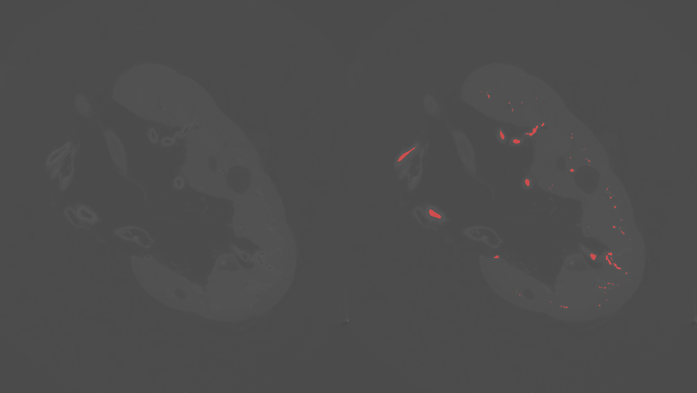

# Kaggle competition "SenNet + HOA - Hacking the Human Vasculature in 3D" solution

Citation: _Yashvardhan Jain, Katy Borner, Claire Walsh, Nancy Ruschman, Peter D. Lee, 
Griffin M. Weber, Ryan Holbrook, Addison Howard. (2023). SenNet + HOA - Hacking the Human Vasculature in 3D._

Link to the competition hosted on Kaggle: https://www.kaggle.com/competitions/blood-vessel-segmentation/overview
The competition ended on Febrary 2024.

My final rank on the private leaderboard was 158/1149. I partecipated to this competition
in order get knowledge about medical imaging tasks.

This was a [code competition](www.kaggle.com/competitions/blood-vessel-segmentation/overview/code-requirements) which requires
to run the code in a notebook in the Kaggle cloud. However, I have used this repository to try my solutions offline before running on the cloud.

## Summary
- [Task and dataset](#task-and-dataset)
  - [Data format](#data-format)
  - [Train dataset](#train-dataset)
  - [Hidden test](#hidden-test)
  - [Evaluation](#evaluation)
  - [Comment](#comment)
- [My solutions](#my-solutions)
  - [Repository structure](#repository-structure)
  - [Possible solutions approaches](#possible-solution-approaches)
    - [2D](#2d)
    - [2.5D](#25d)
    - [3D](#3d)
  - [Backbones and libraries](#backbones-and-libraries)
- [Results](#results)
  - [Ranking](#ranking)
  - [Models' details](#models-details)
  - [What worked and what did not](#what-worked-and-what-did-not)
- [Visualization](#visualization)
  - [Compare 2D slices](#compare-2d-slices)
    - [2D: kidney_3 sparse ground truth Vs model V47](#2d-kidney_3-sparse-ground-truth-vs-model-v47)
  - [Compare full 3D kidney predictions](#compare-full-3d-kidney-predictions)
    - [3D: kidney_3 sparse ground truth Vs model V47](#3d-kidney_3-sparse-ground-truth-vs-model-v47)
## Task and dataset

_"This competition dataset comprises high-resolution 3D images of several kidneys together with 3D segmentation masks_
_of their vasculature. Your task is to create segmentation masks for the kidney datasets in the test set._

_The kidney images were obtained through Hierarchical Phase-Contrast Tomography (HiP-CT) imaging._
_HiP-CT is an imaging technique that obtains high-resolution (from 1.4 micrometers - 50 micrometers resolution)_
_3D data from ex vivo organs. See this [Nature Methods article](https://www.nature.com/articles/s41592-021-01317-x) for more information."_

The dataset is made of 5 kidneys. I have assigned a short name to each one to easily
identify each dataset split configuration.

Full details here: https://www.kaggle.com/competitions/blood-vessel-segmentation/data

### Data format

For each kidney we have the information at the single 2D slice level composing the 3D volume.

- Slices format: each 2D slice is represent as grayscale tiff image
- Ground truth format:
  - each 2D slice ground truth is a grayscale tiff image: 0 - no vessel, 1 - vessel.
  - A single CSV file is also available with all the ground truth for all the kidneys and slices
    in RLE format ([rle-encoded segmentation mask](www.kaggle.com/competitions/blood-vessel-segmentation/overview/evaluation)).
    
### Train dataset

This is the train dataset with ground truth provided for the competition.
Since it is the only split with ground truth it is necessary to further create
a validation/test subsets.

For each kidney I have added a slice example with the ground truth highlighted in red.

- Kidney 1 dense: resolution 912 x 1303, 2279 slices. Short name: 1d.
  _"The whole of a right kidney at 50um resolution. "_
  _The entire 3D arterial vascular tree has been densely segmented, down to two generations from the glomeruli (i.e. the capillary bed). Uses beamline BM05."_.
  
- Kidney 1 voi: resolution 1928 x 1928, 1397 slices. Short name: 1v.
  _"A high-resolution subset of kidney_1, at 5.2um resolution."_.
  _"We provided the higher resolution 5.2um/voxel VOI, to give some example data of different resolutions as we thought this might be useful."_
  
- Kidney 2: resolution 1511 x 1041, 2217 slice. Short name: 2.
  _" The whole of a kidney from another donor, at 50um resolution. Sparsely segmented (about 65%)."_
  
- Kidney 3 dense: resolution 1510 x 1706, 501 slices. Labels only. Short name: 3d.
  _"A portion of a kidney at 50.16um resolution using BM05. Densely segmented. Note that we provide all of the images for kidney_3 in the kidney_3_sparse/images folder. This dataset accordingly has only a labels folder."_
- Kidney 3 sparse: resolution 1510 x 1706, 1035 slices. Short name: 3s.
  _"The remainder of the segmentation masks for kidney_3. Sparsely segmented (about 85%)."_
  

### Hidden test

Two kidneys compose the hidden test of the competition, even the images are not available.

_"Neither of these kidneys are different parts of ones already in the public dataset, i.e. they are physically 
different samples. The scanning and reconstruction procedures follow the method described in the original 
HiP-CT Methods paper (you should read this paper for background), and the manual annotation process is the same as in 
the benchmark review paper."_

Some images are provided as test, but the scope is to develop the competition notebook.
They are not representative of the real test dataset.
During the submission at runtime the fake test dataset is replaced with the real one.

- Public test: _"Continuous 3D part of a whole human kidney imaged with HiP-CT - Originally scanned at 25.14um/voxel and binned to 50.28um/voxel (bin x2) before segmentation."_

- Private Test: _"Continuous 3D part of a whole human kidney imaged with HiP-CT - Originally scanned at 15.77um/voxel binned to 63.08um/voxel (bin x4) before segmentation."

_"The public leaderboard is calculated with approximately 67% of the test data. 
The final results will be based on the other 33%, so the final standings may be different."_
 
Actually there was a significant shake between public and private tests. The 1st resolution remained
the best on both the tests, while the 2nd solution on the private test was beyond the 1000th place in the public.

Also my solution had a low rank on public (880th), but a lot better rank in private (158th). Globally
the score on the private dataset was lower, in my case the drop was below 0.1, which was minimal considering
the average of my competitors. I believe the public leaderboard was poisoned by a lot users relying on a very good public notebook,
but this didn't work on the private test.

### Evaluation

_"We evaluate submissions using the surface dice metric with a tolerance of 0.0._

_You can find the code for the metric in this notebook: [Surface Dice Metric](https://www.kaggle.com/code/metric/surface-dice-metric)."_

The surface dice metric is computed at the 3D level.

The submission format is a CSV file with RLE encoded slices predictions.

### Comment

I didn't exploit the information about the physical um resolution of the scans.

## My solutions

### Repository structure

- **configs**: cfg files used to train the models.
- **data**: scripts necessary to process the dataset.
- **docs**: images for documentation scope.
- **metrics**: metrics code implementation.
- **papers**: relevant papers.
- **visualization**: visualization utilities code implementation.
- **train.py**: train script.
- **eval.py**: evaluation/test script
- other python files: utilities used by `train.py` and `eval.py`.

### Possible solution approaches

#### 2D

Model input: single 2D slice.
Model output: single 2D slice.

Basically the vessel shape information across different slices is ignored.
However this simple approach had good overall results in the competition.

This is my competition notebook implementation https://www.kaggle.com/code/slipknottn/blood-vessel-segmentation-simple-2d
which a simplified version of the code present in this repo.

#### 2.5D

Model input: multiple 2D consecutive slices (e.g. 3 or 5).
Model output: single 2D slice.

It partially uses the vessels shape information across slices, but it doesn't really give a boost
in the accuracy.

#### 3D

Model input: full 3D kidney.
Model output: full 3D kidney.

Not tried, although looking at the competition results it seems not necessary to reach the higher rankings.

### Backbones and libraries

- Custom Unet implementation following "Fundus Images using Modified U-net Convolutional Neural Network" (Afolabi, 2020)
- Unet based on ResNet50 from the "segmentation_models_pytorch" library.

The most relevant experiments were made with and smp_encoder = resnext50_32x4d and imagenet weights.
If not explicitly mentioned, these are the used configurations.

## Results

### Ranking

Private score descending order of online submissions

|     Model             |  Val dataset   | Val avg 2D dice score  | Val surface dice score | Public LB  | Private LB |   Notes    |
|-----------------------|----------------|------------------------|------------------------|------------|------------|------------|
| (Late) Submission V50 |      3s        |       0.269            |        0.398           |   0.552    |   0.500    | Late submission |
| Submission V48        |      3s        |       0.534            |        0.575           |   0.574    |   0.493    | Best submission before the deadline, not selected |
| Submission V47        |      3s        |       0.589            |        0.593           |   0.585    |   0.491    | Best selection for the challenge, rank 158/1149 |
| (Late) Submission V55 |      3s        |       0.433            |        0.494           |   0.566    |   0.480    | Late submission |
| Submission V46        |      3s        |       0.593            |        0.592           |   0.579    |   0.462    | Selected for the challenge  |
| (Late) Submission V53 |      3s        |       0.046 ?!         |        0.061 ?!        |   0.561    |   0.400    | Late submission  |
| Submission V41        |      3s        |       0.550            |        0.401           |   0.493    |   0.374    | tta 5+full_max  |
| (Late) Submission V54 |      3s        |       0.425            |        0.420           |   0.421    |   0.365    | Late submission  |
| Submission V40        |      3s        |       0.579            |        0.326           |   0.291    |   0.251    | No tta  |

### Models' details

|                       |    Train dataset   |   Train resolution | Train augmentation |    Loss    | Test resolution | Test augmentation | Threshold |
|-----------------------|--------------------|--------------------|--------------------|------------|-----------------|-------------------|-----------|
| (Late) Submission V50 |   1d+1v+2          |      512x512       |       my_aug_v2b   | Dice loss  |   1024x1024     |      tta 5+max     |     0.1   |
| Submission V48        |    1d              |      512x512       |       my_aug_v2b   | Dice loss  |   1024x1024     |      tta 5+max     |     0.1   |
| Submission V47        |  1d                |      512x512       |       my_aug_v2b   | Focal loss |   768x864       |      tta 5+max     |     0.4   |
| (Late) Submission V55 |   1d+1v+2          |      512x512       |       my_aug_v2b   | Dice loss  |   768x864       |      tta 5+max     |     0.1   |
| Submission V46        |  1d                |      512x512       |       my_aug_v2b   | Dice loss  |   768x864       |      tta 5+max     |     0.1   |
| (Late) Submission V53 |   1d               |      512x512       |       my_aug_v2b   | Focal loss |   1024x1024     |      tta 5+max     |     0.4   |
| Submission V41        |   1d               |      512x512       |       2.5d_aug     | Focal loss |   1024x1024     |      tta 5+full_max|     0.4   |
| (Late) Submission V54 |   1d+1v+2          |      512x512       |       my_aug_v2b   | Focal loss |   1024x1024     |      tta 5+max     |     0.4   |
| Submission V40        |   1d               |      512x512       |       2.5d_aug     | Dice loss  |   1024x1024     |      No            |     0.1   |

### What worked and what did not

Now some notes and comments about **what worked and didn't work**. Please notice that other competitors with
other approaches could have get different findings. Take a look to the competition discussion forum for the public
post competition community findings.

- Note on reproducibility: I have run the same trainings offline in my machine, but the results are not identical although practically similar 
on the test dataset. This behavior was not corrected even when forcing determinism (determinism is proved to work). It is 
  possible a slight misalignment due to library versions. However, the best models offline were the best online as well.
- It is proved among all competitors that **using a larger training dataset didn't help**. Using just `kidney_1_dense` as train dataset
  and `kidney_3_sparse` as validation / test is enough.
- The **surface metrics** used for the competition **is very sensitive to pixel level predictions**, therefore the selection of 
  the downscaling and, more importantly, **upscaling function is crucial**. In fact after the model prediction (usually performed
  at low resolution) it is necessary to upscale the results to the original resolution.
  I have applied everywhere the "nearest neigbor" (`cv2.INTER_NEAREST`) algorithm, and I obtained a significant boost on the surface dice metric
  w.r.t. to other algorithms, in particular the default "bilinear interpolation" (`cv2.INTER_LINEAR`).
  Side note: I have found the same behavior while dealing with multi-stage 2D human pose estimation which requires an upscaling step.  
- **Another big improvement depends on the test-time-augmentation**. I have found very effective to split the image into 5 parts: 
  top-left, top-right, bottom-left, bottom-right and center and get the maximum as the aggregated prediction over the whole image.
  This makes sense to reduce the false negatives which is the main issue of my models, I called this `5+max`.
  Interestingly the results get worse by adding the full image into the calculation, it adds too many false positives. I called this `5+fullmax`.
  I can't really explain this, because the model is trained with both zoomed and not zoomed images, in some cases only not zoomed images.
- I have used a **Unet implementation from the `segmentation_pytorch_models` library with ResNet 50 encoder**.
  I noticed this model heavily used by the other competitors, and I decided to switch to it to reduce
  the reasons of low performances I had at the beginning. It is possible that applying all the tunings 
  I implemented later my Unet implementation from scratch could work decently well, but I didn't try further.
  However the `segmentation_pytorch_models` provides very good baseline models, I didn't explore different pretrained
  models and Unet implementations present in the library, because I preferred to focus on the training and test pipelines first.
- **Augmentation is another crucial aspect to get good results**. After some experiments from scratch, to reduce
  the reasons of low performances I had at the beginning I decided to use an augmentation strategy publicly available in a Kaggle notebook.
  I called that `2.5d_aug` because the implemented approach was a 2.5d one, and you can find the details in `data/transforms.py`.
  This helped me to improve my original results, but my test script was not tuned for that training augmentation,
  since I used my own inference strategy instead of the author's one.
  **I got the best results with `my_aug_v2b`**, interestingly **it doesn't apply any zoom during the training**, 
  but it works better than the others also when **I use tta with zoomed crops only instead of full image like the training**.
  As already explained in the tta point, actually adding the full image hurts the performances. 
  This should be better investigated.
- I have experimented with **different losses**: BCE, **dice loss and focal loss**.
  The last two gives me the best results, practically they are very similar, **I can't call a real winner**.
  It is interesting that the behavior of the model is different. **When trained with dice loss, the model suffer 
  FNs**, so applying different thresholds to the confidence doesn't solve it. Actually there are no significant
  change from 0.1 to 0.9 threshold on the metric scores, so I decided to use 0.1 as threshold for dice loss models. 
  On the contrary, **with the focal loss the models tend to produce more FPs which can be mitigated with a proper threshold**.
  The metric scores starts to decrease with threshold 0.5 and becomes totally trash with 0.75.
  I have found 0.4 to be a good value. In any case in the end a model trained with dice loss and 0.1 threshold
  has the same performances of a model trained with focal loss and 0.4 threshold. There are still FNs that the model
  is not able to get.

Hardly explainable behaviors:
- Volatility: I was able to get a reasonable correlation between offline results on `kidney_3_sparse` as test dataset
  and competition hidden dataset, although some results remain not explainable. Moreover, after the competition it was
  found that the private test is a lot harder than the public one, we don't have the data at disposal to understand why.
  Take a look to ["Hidden test"](#hidden-test) for some details about the competition shake.
- The difference between the late submissions V55 and V50 is hardly explainable. The model is the same, the only difference is 
  the slight difference on the inference resolution (1024x1024 of V50, 768x864 of V55). The strangest thing
  is that V50 is very bad on local `kidney_3_sparse` w.r.t the other models, but it is the best on the private LB (but not on the public LB).
  On the other side V55 is lot better on `kidney_3_sparse` but not on the hidden test, although similar.
- Another even more evident outlier is V53 which is very bad on `kidney_3_sparse`, but competitive on the hidden test.
  The metrics during the training were very low, some lines artifact are always visible in the prediction, so the local 
  results are coherent, but it is not explainable why the same model performs so well in the cloud on the test.
  

## Visualization

### Compare 2D slices

Image tiles descriptions:
- Top left: original image
- Top middle: ground truth
- Top right: comparison prediction Vs ground truth overlay on image
- Bottom left: raw prediction
- Bottom middle: binarized prediction with threshold
- Bottom right: comparison

Colors:
- Green: true positives
- Blue: false negatives
- Red: false positives

#### 2D: kidney_3 sparse ground truth Vs model V47

The model was not trained on these examples regarding `kidney_3_sparse`.

Slice 170/1035 - Dice score 0.42 (a lot of false negatives)

Slice 785/1035 - Dice score 0.80

Comment: the model works well with small vessels, but it completely ignores
the big one on the left. This is more evident with the 3D visualization below.

### Compare full 3D kidney predictions

The 3D points clouds are rescaled to 10% for faster processing

Colors:
- Green: true positives
- Blue: false negatives
- Red: false positives

#### 3D: kidney_3 sparse ground truth Vs model V47

Surface dice score: 0.593.

Here we can clearly see where the false negatives are more present.

You can see the same amount of false negatives in the first 2D slices
starting from the bottom (lower indexes) already reported in 
["2D: kidney_3 sparse ground truth Vs model V47"](#2d-kidney_3-sparse-ground-truth-vs-model-v47).